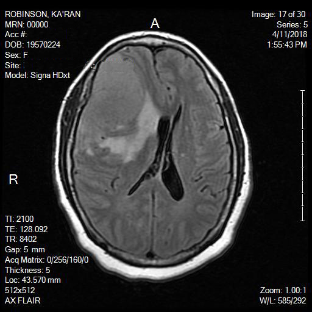
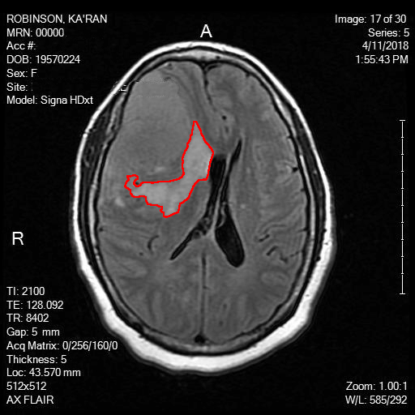

# BrainTumorDetection
>B.Sc. Final Year Project for detecting Brain Tumors from MRI of Brain. Implementation is in C++ language....

### To run the code--:
> Step-1: Put `detectTumor.cc`, `Bitmap.h`, and the image in same folder. 
> Step-2: Run the command `g++ detectTumor.cc` in Ubuntu Terminal. 
> Step-3: Give the brain image filename. 
> Step-4: Resultant image file name will start with "_Result_". 

### Example Input & Output--:

1. Input Image: 

2. Output Image: 

Thats all.... Thank You....
